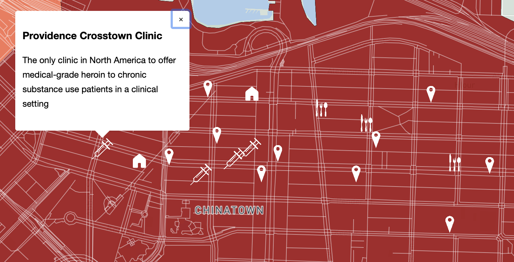

# lab1

Reflective Analysis & Critique

I began this project with the intention to create a very different map from the one presented. I wanted to explore the relationship between illicit drug addiction or toxicity deaths and trauma, illustrating changes over the course of 5 years, from 2015 to 2020. Specifically, how Adverse Childhood Experiences (ACEs), strong predictors of future health-risks (including addiction) and mortality. However, ACEs studies are small and the raw data is not available to the public, especially that which discloses geographic data. Therefore, I had to explore other avenues. I tried naloxone distribution data, datasets pertaining to emergency department visit due to opioid-related overdose, I even tried to geolocate the ‘#OCO16’ which emerged after the declaration of a public health emergency. I began to consider a different direction towards community response and resiliency. I finally stumbled upon ‘Community Heart Asset Mapping’ with the help of professor Bergmann which solidified the idea to map relevant community assets for health and safety of Downtown Eastside residents. 

I have styled the base map from the monochrome blue style to a light sage, with differing tints to reflect landscape elements. A light sage was used in particular to provide a base map that would not detract from the thematic map layers on top, while providing an aesthetically pleasing backdrop seen only when the map is zoomed out. The choropleth map mapped the illicit drug toxicity death rates per 100,000 people in the Greater Vancouver area by Local Health Area (LHA). I decided local heath area would best represent the distinctly high rates of drug toxicity deaths in the Downtown Eastside in 2016. The color scheme was chosen from the single hue color ramps provided by the color brewer website. I decided on red as it tends to be used for thematic mapping of data with ‘negative’, as we see recently in rates of Coronavirus infection or death. 

The points I have mapped on top of the choropleth are areas identified by community members as both physical assets and intangibles such as sense of community, safety, and security. The symbology of the points is important to express the needs that area or service provides. The syringe symbols represent supervised injection sites, including the unsanctioned tents put up during the height of drug toxicity deaths in the DTES during the beginning of what is now referred to as the ‘opioid crisis’ in 2016. The house symbols represent two particularly coveted affordable housing locations that work with the needs of residents to create an atmosphere that suits their diverse needs. The knife, fork, and spoon were created to symbolize locations in which food and food security were at the forefront of their organization goals. The location point markers show general community assets such as resource and community centers. I chose to make these points white to contrast with the dark red background of the DTES LHA and with the mindset that less color variation is generally more powerful. In hindsight, it may have been better to fill them with a lighter blue hue to contrast them from the roads, something that was suggested to me in the map critique by Jia Yuan Gu. 
My map could be improved in numerous ways. For example, Jia Yuan Gu suggested I use the FlyTo command that would animate the map to zoom to the community asset points to immediately show the viewer the focus of the map, as the points are clustered specially in the DTES. I would have also liked to illustrate the changes in toxicity deaths over the years as effected by the arrival of fentanyl, carfentanil, and the impacts of the Coronavirius. I would have changed the points to reflect the changes in the area over this time, as I did with the unsanctioned injection sites that were particular to the end of 2016. More broadly, the DTES is an extremely diverse and complex community, with a tumultuous history. I think it will always be difficult to capture these complexities in the confides of a map, the data available, and without the numerous perspectives and lived experiences of the DTES community. This map is just the beginning of a more nuanced understanding. 
